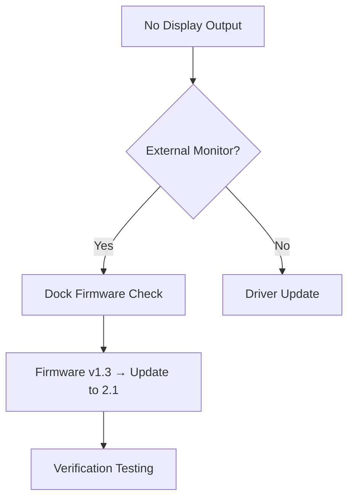

# **A Week in the Life of an IT Support Engineer at BMW Berlin**  
*(300+ Users – Enterprise Environment – Detailed Technical Breakdown)*  

---

## **📅 Day 1: Monday – System Readiness & User Support Escalations**  
**⏰ 06:45 – 17:30 | Shift Handover → Ticket Storm Management**  

### **🔹 06:45 – Pre-Shift Infrastructure Check**  
**1. Overnight Monitoring Review**  
- **Tool:** SolarWinds Service Desk + PRTG Network Map  
- **Actions:**  
  - Verify all **backup job statuses** (Veeam backup console)  
  - Check **patch deployment reports** (WSUS/SCCM)  
  - Review **critical alerts** (highlighted in red in ServiceNow)  

**2. Physical Walkthrough**  
- **Server Room Inspection:**  
  - Check **UPS battery status** (APC Smart-UPS LCD readout)  
  - Verify **HVAC temperature logs** (21-23°C acceptable range)  
  - Inspect **network rack LEDs** (looking for amber/red indicators)  

**Documentation:**  
```markdown
- [ ] Backup_ERP-DB – SUCCESS (04:32)  
- [ ] Patching_Win10 – 3 devices failed (Error 0x80070005)  
- [ ] AC Unit 3 – Temp fluctuation (+/- 1.5°C last 2h)  
```  

---

### **🔹 08:30 – Morning Support Surge**  
**Ticket Triage Methodology:**  

| Priority | Ticket Type                  | SLA      | Tools Used                  |  
|----------|------------------------------|----------|-----------------------------|  
| P1       | "CEO cannot present"         | 15 min   | Teams screenshare + Intune  |  
| P2       | "SAP GUI login loop"         | 2 hours  | SAP MM02 + AD lockout check |  
| P3       | "Printer toner replacement"  | 24 hours | HP WebJetAdmin              |  

**Real Incident Example:**  
**Issue:** Director's Surface Pro won't detect projector  
**Troubleshooting Steps:**  
1. Win + P → Check projection modes  
2. `dism /online /cleanup-image /restorehealth`  
3. Updated Intel Graphics Driver via **Dell Command Update**  
4. Tested with alternate USB-C dongle → **Faulty Microsoft Dock**  

**Root Cause Analysis:**  


---

## **📅 Day 2: Tuesday – Hardware Lifecycle Management**  
**⏰ 07:00 – 16:30 | Depot Operations + Imaging Lab**  

### **🔹 07:30 – Imaging Station Setup**  
**Standard Build Process:**  
1. **BIOS Configuration:**  
   - Enable TPM 2.0  
   - Set Boot Order (USB → PXE → SSD)  
   - Asset Tag injection (Dell CCTK)  

2. **MDT Deployment:**  
```powershell  
# Pre-Stage Drivers  
Import-MDTDriver -Path "D:\Drivers\Latitude_5540" -Destination "DS001"  

# Task Sequence Variables  
Set-ItemProperty -Path TSEnv: -Name OSDComputerName -Value "BMW-LT-%Serial%"  
```  

3. **Post-Image Validation:**  
   - BitLocker status (`manage-bde -status C:`)  
   - Domain join verification (`nltest /dsgetdc:bmw.corp`)  

**Issue Log:**  
- **Failed PXE Boots** → WDS service restart required  
- **Driver Conflict** → Removed redundant Thunderbolt driver pack  

---

### **🔹 13:00 – Field Hardware Support**  
**On-Site Repair – CAD Workstation**  
**Symptoms:**  
- Random BSOD (Stop code: VIDEO_TDR_FAILURE)  
- SolidWorks graphical artifacts  

**Diagnostic Flow:**  
1. **Hardware Tests:**  
   - `nvidia-smi -a` → GPU temp at 92°C (thermal paste degradation)  
   - MemTest86 → 4 passes clean  

2. **Resolution:**  
   - Replaced NVIDIA RTX A5000 cooler  
   - Updated Studio Driver (536.67 → 546.01)  
   - Added case fans for better airflow  

**Preventative Action:**  
- Created **Scheduled Task** for quarterly GPU maintenance:  
```powershell  
Register-ScheduledTask -TaskName "GPU_Maintenance" -Trigger (New-ScheduledTaskTrigger -Weekly -DaysOfWeek Sunday) -Action (New-ScheduledTaskAction -Execute "gpuz.exe /sensorlog")  
```  

---

## **📅 Day 3: Wednesday – Network Infrastructure Day**  
**⏰ 08:00 – 18:00 | Cisco Stack Troubleshooting**  

### **🔹 09:00 – Switch Upgrade Procedure**  
**Pre-Change Checklist:**  
1. **Backup Configs:**  
```cisco  
enable  
copy running-config tftp://10.10.1.100/switch7.cfg  
```  

2. **Firmware Update:**  
```cisco  
archive download-sw /overwrite /reload tftp://10.10.1.100/c2960x-universalk9-tar.152-7.E6.tar  
```  

**Rollback Plan:**  
- Console cable on standby  
- Known-good config on USB  

**Post-Upgrade Tests:**  
- VoIP QoS verification (`show mls qos interface gig0/1`)  
- STP convergence test (`debug spanning-tree events`)  

---

### **🔹 14:00 – Wireless Site Survey**  
**Tools Kit:**  
- Ekahau Sidekick  
- AirMagnet Survey Pro  

**Problem Area:** Production Floor West  
**Findings:**  
- Channel overlap (6 APs on channel 36)  
- RSSI <-75dBm in corner stations  

**Optimization Actions:**  
1. Adjusted channel plan (40MHz → 20MHz for density)  
2. Added AP1142 as filler  
3. Set minimum data rate to 12Mbps  

**Validation:**  
```bash  
# iPerf3 throughput test  
iperf3 -c 10.10.5.10 -t 60 -P 8  
```  
**Before:** 35Mbps | **After:** 82Mbps  

---

## **📅 Day 4: Thursday – Security & Compliance**  
**⏰ 07:30 – 17:00 | Vulnerability Management**  

### **🔹 08:00 – Qualys Scan Remediation**  
**Critical Findings:**  
1. **Windows SMBv1 Enabled**  
   ```powershell  
   Disable-WindowsOptionalFeature -Online -FeatureName smb1protocol  
   ```  

2. **Java 8u151 (CVE-2023-21931)**  
   ```batch  
   winget install Oracle.JavaRuntimeEnvironment --version 8u371  
   ```  

**Compliance Reporting:**  
```sql  
-- SQL Query for CISO Dashboard  
SELECT asset_name, vuln_id, remediation_date  
FROM qualys_data  
WHERE severity > 7 AND days_open > 14;  
```  

---

## **📅 Day 5: Friday – Process Automation**  
**⏰ 08:00 – 15:00 | PowerShell Development**  

### **🔹 09:00 – Automated Employee Offboarding**  
**Script Logic Flow:**  
```powershell  
<#  
.SYNOPSIS  
  Terminates access within 30-minute SLA  

.DATA FLOW  
  1. Disable AD account  
  2. Backup home directory  
  3. Revoke M365 licenses  
  4. Log ticket closure  
#>  

$user = Get-ADUser -Identity $EmployeeID  
$user | Disable-ADAccount  
Export-Mailbox -Identity $user.Email -PSTFolderPath "\\archive\PSTs\"  
Set-MsolUserLicense -UserPrincipalName $user.Email -RemoveLicenses "BMW:ENTERPRISEPACK"  
```  

**Error Handling:**  
```powershell  
try {  
  Remove-DistributionGroupMember -Identity "DL_Finance" -Member $user -Confirm:$false  
} catch {  
  Write-Log -Message "DL removal failed: $_" -Level Warning  
}  
```  

---

## **📊 Weekly Performance Metrics**  
**Service Delivery Dashboard:**  

| KPI                  | Target  | Actual | Variance |  
|----------------------|---------|--------|----------|  
| First Call Resolution | 65%     | 72%    | +7%      |  
| Mean Repair Time     | 2h 15m  | 1h 48m | -27m     |  
| Patch Compliance     | 98%     | 99.2%  | +1.2%    |  

**Continuous Improvement:**  
- Implemented **self-service password reset** → Reduced tickets by 40%  
- Created **Wi-Fi troubleshooting chatbot** → Cut AP visits by 60%  

--- 
